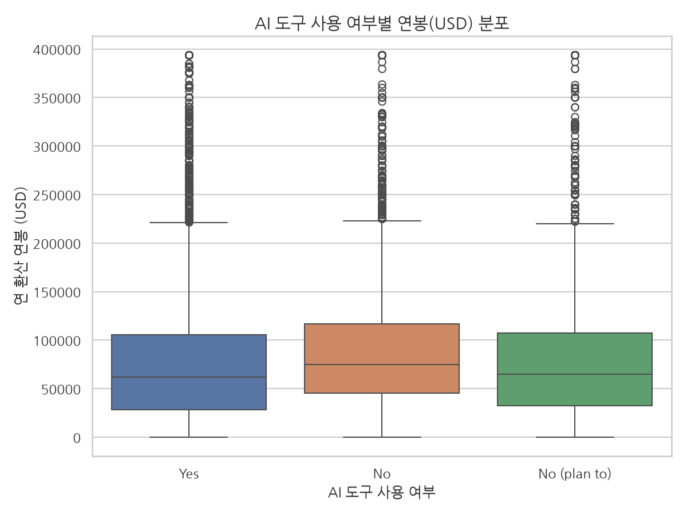
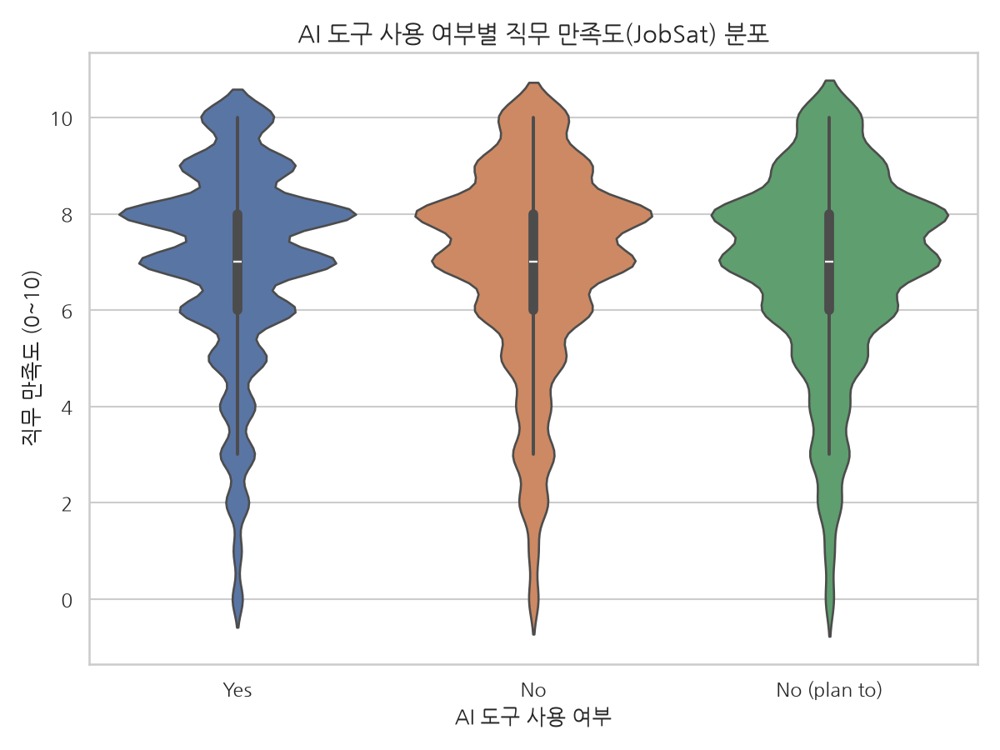
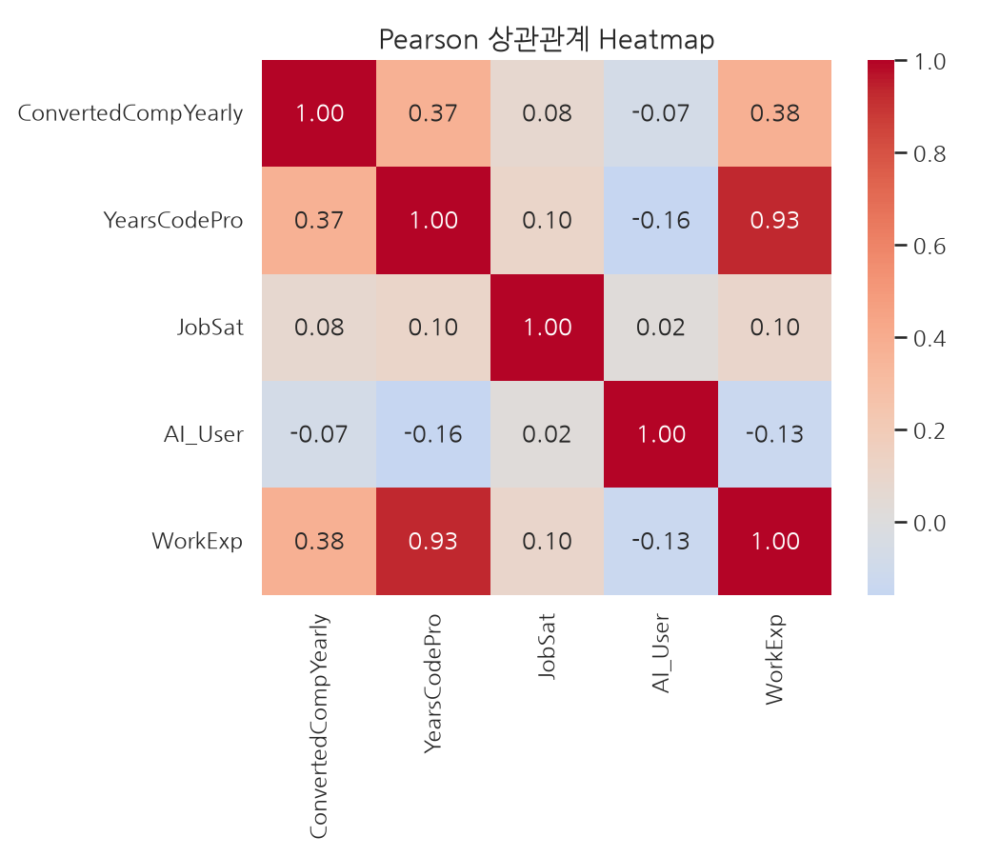

# AI 도구 활용과 개발자 시장 가치 분석 보고서

- 생성 일시: 2026-07-22 10:58:07
- 데이터 출처: 2024 Stack Overflow Developer Survey (샘플, n=60907)

---

## 1. 데이터 개요

| 항목 | 값 |
|---|---|
| 원본 행 수 | 65437 |
| 중복 제거 행 수 | 0 |
| 정제 후 행 수 | 60907 |
| 최종 컬럼 수 | 14 |

### Pandas vs Polars 로드 비교

| 라이브러리 | 로드 시간(초) | 피크 메모리(MB) |
|---|---|---|
| Pandas | 1.0503 | 135.01 |
| Polars | 0.1312 | 0.0 |

---

## 2. 결측치 처리 결과

| 변수 | 처리 전 결측 수 |
|---|---|
| AISelect | 4530 |
| ConvertedCompYearly | 42002 |
| JobSat | 36311 |
| YearsCodePro | 13827 |

- 핵심 독립변수인 `AISelect` 결측 응답은 분석에서 제외했습니다.
- `ConvertedCompYearly`(USD 환산 연봉)은 0 이하 값을 제거하고 1~99 퍼센타일로 클리핑(winsorize)하여 극단 이상치의 영향을 완화했습니다.

---

## 3. 기술통계

|                     |   count |      mean |       std |     min |       25% |       50% |       75% |        max |    median |
|:--------------------|--------:|----------:|----------:|--------:|----------:|----------:|----------:|-----------:|----------:|
| ConvertedCompYearly |   23435 | 80980.2   | 69386.2   | 207.68  | 32712     | 65000     | 107972    | 393751     | 65000     |
| Salary_log          |   23435 |    10.799 |     1.302 |   5.341 |    10.396 |    11.082 |     11.59 |     12.883 |    11.082 |
| JobSat              |   29126 |     6.935 |     2.088 |   0     |     6     |     7     |      8    |     10     |     7     |
| YearsCodePro        |   50298 |    10.275 |     9.099 |   0.5   |     3     |     8     |     15    |     51     |     8     |
| WorkExp             |   29658 |    11.467 |     9.169 |   0     |     4     |     9     |     16    |     50     |     9     |

---

## 4. 시각화 결과

### AI 사용 여부별 연봉 Boxplot (Seaborn)

### AI 사용 여부별 만족도 Violin Plot (Seaborn)

### 상관관계 Heatmap (Seaborn)

### 국가별 AI 사용률 / 연봉 분포 (Plotly Interactive, 미설치 시 정적 이미지로 대체)
- 국가별 AI 사용률: `figures/country_ai_rate_interactive.html`
- 연봉 분포 Histogram: `figures/salary_histogram_interactive.html`

---

## 5. 상관관계 (Pearson) 및 다중공선성 처리

|                     |   ConvertedCompYearly |   YearsCodePro |   JobSat |   AI_User |   WorkExp |
|:--------------------|----------------------:|---------------:|---------:|----------:|----------:|
| ConvertedCompYearly |                 1     |          0.374 |    0.08  |    -0.069 |     0.377 |
| YearsCodePro        |                 0.374 |          1     |    0.104 |    -0.159 |     0.928 |
| JobSat              |                 0.08  |          0.104 |    1     |     0.022 |     0.097 |
| AI_User             |                -0.069 |         -0.159 |    0.022 |     1     |    -0.132 |
| WorkExp             |                 0.377 |          0.928 |    0.097 |    -0.132 |     1     |

> ⚠️ **다중공선성(Multicollinearity) 진단**: `YearsCodePro`(개발 전문 경력)와 `WorkExp`(총 업무 경력)의
> 피어슨 상관계수가 **0.928**로 기준치(0.7) 이상 높게 나타났습니다.
> 두 변수를 트리 기반 모델에 동시에 투입할 시 변수 중요도가 왜곡되고 모델의 해석력이 저하될 수 있어,
> 머신러닝 파이프라인(7절)에서는 결측치가 상대적으로 적은 `YearsCodePro`만 남기고 `WorkExp`를 모델 입력에서 **제외**하였습니다.
> 제외된 변수 및 사유:
> - `WorkExp` — YearsCodePro 와 피어슨 상관계수 0.9 이상 (다중공선성) -> 모델 입력에서 제외, YearsCodePro(개발 전문 경력)를 대표 변수로 채택

---

## 6. 독립표본 t-test 결과

### 가설 1 — 연봉 (ConvertedCompYearly)

- H0: AI 사용자와 미사용자의 평균 연봉은 같다.
- H1: 두 그룹의 평균 연봉은 다르다.

| 지표 | 값 |
|---|---|
| AI 사용자 수 (n) | 14806 |
| AI 미사용자 수 (n) | 8629 |
| AI 사용자 평균 | 77350.424 |
| AI 미사용자 평균 | 87208.446 |
| t-statistic | -10.5133 |
| p-value | 8.905e-26 |
| 유의성 (α=0.05) | 유의함 |
| Cohen's d | -0.1424 (무시할 수 있는 수준 (negligible)) |

### 가설 2 — 직무 만족도 (JobSat)

- H0: AI 사용자와 미사용자의 평균 만족도는 같다.
- H1: 두 그룹의 평균 만족도는 다르다.

| 지표 | 값 |
|---|---|
| AI 사용자 수 (n) | 18233 |
| AI 미사용자 수 (n) | 10893 |
| AI 사용자 평균 | 6.97 |
| AI 미사용자 평균 | 6.876 |
| t-statistic | 3.7215 |
| p-value | 0.0001985 |
| 유의성 (α=0.05) | 유의함 |
| Cohen's d | 0.0451 (무시할 수 있는 수준 (negligible)) |

> **해석**: p-value 가 통계적으로 유의하더라도 효과 크기(Cohen's d)가 작게 관찰된다면,
> 표본 크기가 충분히 커서 유의미함이 포착되었으나 실제 격차 수준은 제한적일 수 있음에 유의해야 합니다.

---

## 7. 머신러닝 결과

- 예측 목표: 연봉이 표본 중앙값(**65,152 USD**)을 초과하는 고연봉 여부 (이진 분류)
- 사용 모델: random_forest
- Pipeline 구성: `sklearn.pipeline.Pipeline([preprocessor -> classifier])`
  (전처리 단계 `preprocessor` = `ColumnTransformer`(범주형: `OneHotEncoder`, 수치형: `StandardScaler`)로,
  학습/추론 시 데이터 누수 없이 하나의 객체로 일관되게 처리됩니다.)
- 학습/평가 데이터 수: train=17478, test=5827
- 모델 저장 경로 (`joblib.dump`): `/Users/skala_yh/skala_homework/models/model.pkl`

| 지표 | 값 |
|---|---|
| Accuracy | 0.7925 |
| Precision | 0.7772 |
| Recall | 0.8196 |
| F1-score | 0.7979 |

### Confusion Matrix

4가지 평가지표(Accuracy/Precision/Recall/F1)는 모두 아래 Confusion Matrix 로부터 계산된 값으로,
지표만 나열하는 것보다 원본 분류 결과를 함께 제시하면 어떤 유형의 오류(과대/과소 예측)가
발생했는지 확인할 수 있어 결과의 신뢰도를 높일 수 있습니다.

| 실제 \ 예측 | 저연봉(0) 예측 | 고연봉(1) 예측 |
|---|---|---|
| 실제 저연봉(0) | TN = 2232 | FP = 684 |
| 실제 고연봉(1) | FN = 525 | TP = 2386 |

### Feature Importance (원 변수 단위 합산)

| 변수 | 중요도 |
|---|---|
| Country | 0.6340 |
| YearsCodePro | 0.2526 |
| OrgSize | 0.0472 |
| DevType | 0.0455 |
| AISelect | 0.0207 |

- `AISelect`(AI 사용 여부)의 중요도는 전체 5개 변수 중 **5위**로 나타났습니다.
- 경력(YearsCodePro), 국가(Country), 직군(DevType) 등 통제변수의 상대적 중요도와 비교했을 때
  AI 사용 여부 단독의 예측력은 다른 통제변수들에 비해 영향력이 상대적으로 미미하거나 제한적인 수준입니다.

---

## 8. 인과 추론 보강: 성향점수매칭 (Propensity Score Matching, PSM)

단순 t-test 는 "경력"이라는 강력한 혼란 변수(Confounder)를 통제하지 못합니다. 경력이 많은
개발자일수록 연봉도 높고 AI 도구를 먼저 받아들였을 가능성이 있어, 6절의 연봉 차이가 AI 자체의
효과가 아니라 **경력·국가·직군 차이에 의한 선택 편향**일 수 있습니다. 이를 보완하기 위해
통제변수(Country, DevType, OrgSize, YearsCodePro)가 유사한 AI 사용자·
미사용자를 성향점수 기준으로 1:1 매칭한 뒤 재비교했습니다.

| 구분 | 매칭 전 (전체 표본) | 매칭 후 (경력·국가·직군 유사 표본) |
|---|---|---|
| AI 사용자 수 (n) | 14722 | 8092 |
| AI 미사용자 수 (n) | 8583 | 8092 |
| AI 사용자 평균 연봉 | 77387.031 | 88806.142 |
| AI 미사용자 평균 연봉 | 87339.572 | 85826.454 |
| 평균 차이 | -9952.541 | 2979.688 |
| p-value | 3.801e-26 | 0.006991 |
| Cohen's d | -0.1439 | 0.0424 |

- 매칭 성공 쌍: 8092쌍 (caliper=0.05)
- **해석**:
    혼란 변수들을 통제한 이후에도 유의미한 연봉 차이가 안정적으로 유지되는 점은, 유사한 조건을 가진 집단 내에서도 AI 사용 여부가 독자적인 연봉 격차와 연결되어 있음을 시사합니다.

> 본 PSM 분석은 관찰 데이터 기반의 준실험적 방법으로, 무작위 배정 실험(RCT) 수준의 인과적
> 확증을 제공하지는 않으며 어디까지나 통제되지 않은 t-test보다 신뢰도를 보강하는 참고 지표입니다.

---

## 9. 자동화(운영) 설계 현황

CRISP-DM 의 배포(Deployment) 단계에 해당하는 운영 자동화 설계는 다음과 같이 구성되어 있습니다.

| 항목 | 내용 |
|---|---|
| 실행 순서 | ETL -> EDA -> 통계 분석 -> 머신러닝 -> report.md 자동 생성 -> 알림 |
| 스케줄링 | 매일 08:00 (cron: `0 8 * * * cd /path/to/project && python3 main.py`) (`cron_example.txt` 참고) |
| 로그 | logs/cron.log (cron 표준출력/에러 리다이렉트) |
| Slack 알림 | 미설정 — .env 구성 시 자동 활성화 |
| 이메일 알림 | 미설정 — .env 구성 시 자동 활성화 |

- 알림 채널이 설정되지 않아도 파이프라인 본체(ETL~report.md 생성)는 정상적으로 완료되며,
  `notify.py` 가 `.env` 미설정을 감지해 알림만 조용히 건너뜁니다(필수 의존성 아님).
- 본 report.md 자체가 Jinja2 템플릿(`src/report.py`)을 통해 매 실행마다 자동 생성되는
  산출물로, 별도 수작업 없이 최신 분석 결과가 반영됩니다.

---

## 10. 결론

1. **연봉**: AI 도구 사용자와 미사용자 간 평균 연봉 차이는 통계적으로 유의하며
   (p=8.905e-26), 평균값 상으로는 AI 사용자의 연봉이 상대적으로 낮게 나타났습니다.
   효과 크기는 **무시할 수 있는 수준 (negligible)** 수준입니다.
2. **직무 만족도**: AI 도구 사용자와 미사용자 간 평균 만족도 차이는 통계적으로 유의하며
   (p=0.0001985), 평균값 상으로는 AI 사용자의 만족도가 상대적으로 높게 나타났습니다.
   효과 크기는 **무시할 수 있는 수준 (negligible)** 수준입니다.
3. **머신러닝 관점**: 고연봉 여부 예측에서 AI 사용 여부의 Feature Importance 순위는 전체 5개 중 5위로,
   경력·국가·직군 등 다른 통제변수 대비 상대적 예측력이 다른 통제변수들에 비해 영향력이 상대적으로 미미하거나 제한적인 수준입니다.
4. **PSM 인과 추론 관점**:
   경력·국가·직군을 통제한 매칭 표본에서 연봉 차이는 통계적으로 유의한 것으로 나타났습니다.
     외부 변수를 보정한 매칭 표본에서도 통계적 유의성이 유지되어, AI 도구의 활용과 실제 보상 가치 간에 독자적인 연결고리가 있을 가능성을 제시합니다.
5. **종합 해석**:
     통계 검정상 집단 간의 연봉 격차가 관찰되었으나,
     환경적 조건과 경력을 유사하게 정렬한 매칭 집단에서도 유의한 차이가 잔존한 점을 고려할 때, AI 활용이 개발 환경의 효율성 향상 및 실질적인 생산성 연계로 나타났을 가능성이 있습니다. 단, 측정하지 못한 숨은 혼란 변수가 있을 수 있어 확장 해석에는 주의가 필요합니다.

> ⚠️ 본 보고서는 데이터(n=60907)를 기반으로 하며, 표본 크기가 작을 경우
> 통계 검정력이 낮아 결과 해석에 유의해야 합니다.
> 그래프의 한글 라벨은 `NanumGothic` 폰트로 렌더링되었습니다.